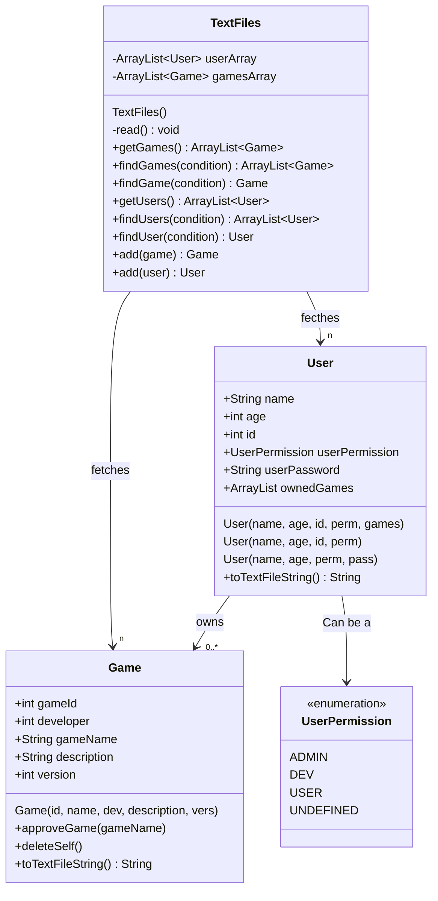
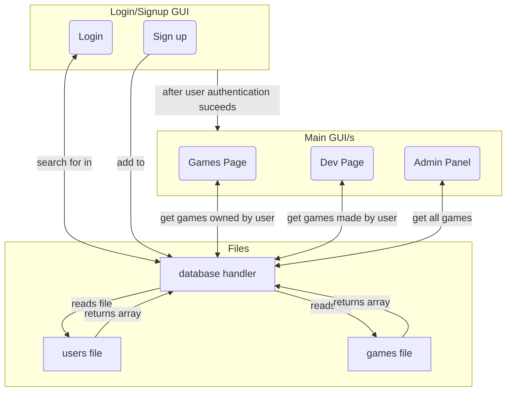

# Lehlogonolo's PAT

# Class Diagram

**
`TextFiles` contains multiple instances of `User` and `Game`'s classes while a User has 0 or more references to a Game's `gameId` property
**

# Design Flow of PAT

